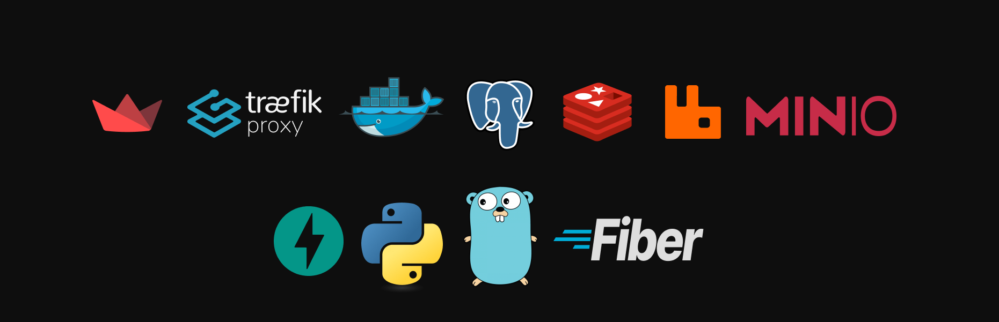

### Oh hi there!

Welcome to my gh profile 🤝🏽

I am ahmed, a backend engineer located in Qatar! I work at <code><a href="https://kanari.ai">Kanari AI</a></code>, a startup pioneering in dialectal speech technology 🌐

my expertise spans: system design, optimizations, app sec and ofcourse backend engineering... I worked on many projects in the past, from ASR & TTS to auctions & e-commerce platforms to sustainability & carbon pricing to football & referee selection to even AI in drones 🚀

As you may have guessed already, I am a huge fan of Go and Python, most of my work is done in both of these languages but I would call my self a gopher 🐹

I contribute to open source software from time to time. I even built some myself, check them out below 👇🏽

 

